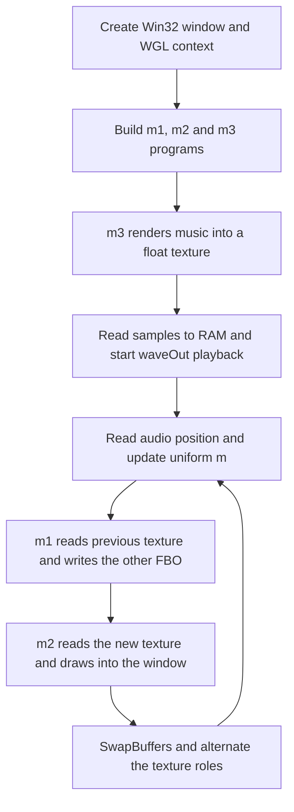

# OpenGL assessment and adaptation plan

## The renderer already uses OpenGL

There is no active Direct3D renderer or HLSL shader to translate in this checkout.

| Evidence | Meaning |
| --- | --- |
| [definitions.h](../src/definitions.h) includes `<GL/gl.h>` and defines an OpenGL pixel format | The drawing surface is configured for OpenGL. |
| [main.cpp](../src/main.cpp) calls `wglCreateContext` and `wglMakeCurrent` | Windows creates and activates an OpenGL context. |
| [gldefs.h](../src/gldefs.h) resolves functions through `wglGetProcAddress` | Modern GL entry points come from the active graphics driver. |
| [fragment.frag](../src/shaders/fragment.frag) begins with `#version 330` | Effects are written in GLSL. |
| [Lev4k.vcxproj](../Lev4k.vcxproj) links `opengl32.lib` | The application links the Windows OpenGL interface. |

There are two qualifications to a repository-wide “no DirectX” claim. The optional `Song` audio-file class uses **DirectShow**, via `<dshow.h>` and COM. Oidos also contains an `ID3D11Texture2D_ID` symbol used as reusable data; its name does not indicate a Direct3D graphics path. Removing all DirectX-family dependencies would additionally require replacing or excluding the DirectShow audio-file component.

## Current rendering sequence

This diagram describes the default shader-audio configuration. Music is generated at startup and, by default, again after editor shader reload. The scene renders directly into one of two RGBA32F FBO attachments; the previous main image is available to `m1` through `sb1`. Successful reloads and Editor timeline changes clear history. See [LastFrameBuffer](last-frame-buffer.md).

## Existing compatibility assumptions

The runtime uses `glRects`, fragment-only programs, and the legacy `GL_LUMINANCE_ALPHA` transfer format. These depend on compatibility functionality. A switch to a core-profile context alone would break the renderer and music path.

`#version 330` describes the shader language version, not every host API requirement. `glCreateShaderProgramv` is available in OpenGL 4.1 or through `GL_ARB_separate_shader_objects`; the current code does not test either condition. An initial supported target should therefore explicitly require compatible GL functionality plus that API. Unused macros such as `glGenerateTextureMipmap` in `gldefs.h` do not by themselves impose an OpenGL 4.5 requirement. [Khronos OpenGL 4.1 reference card](https://www.khronos.org/files/opengl41-quick-reference-card.pdf), [separate shader objects specification](https://registry.khronos.org/OpenGL/extensions/ARB/ARB_separate_shader_objects.txt).

On Windows, function addresses must be obtained for an appropriate current context. Add version/extension checks as well as pointer validation. [Microsoft `wglGetProcAddress` documentation](https://learn.microsoft.com/en-us/windows/win32/api/wingdi/nf-wingdi-wglgetprocaddress).

## Shader selection and reload

The host compiles the shared source for each pass by changing its `#define m1 main` directive. Editor's [replaceShaderPrograms](../src/debug.h) finds that exact marker in a writable source buffer instead of assuming a fixed byte offset. Both LF and CRLF are accepted.

Editor links every active pass before replacing the current program set. A failed pass produces a diagnostic and releases the candidate programs; the old programs, audio-reset state, and frame history remain intact. A successful reload replaces the set, releases the old programs, and requests audio regeneration and a history reset. The [GPU probe](last-frame-buffer.md#reproduce-the-gpu-checks) checks failures in each of the three default passes and successful recovery.

The compact Snapshot/Release path retains `MULTI_MAIN_LOCATION = 22` for the generated minified source. The probe verifies that offset and links the generated passes. Preserve the `#define m1 main` spelling and regenerate the embedded shader after edits.

For a larger refactor, supply the version directive, pass definition, and shared body as separate shader source strings. Keep `#version` first. This removes byte-offset patching entirely. Preserve pass functions during minification: the current command protects `m1,m2,m3,m4`, and preserves external uniform names. [Shader Minifier usage](https://github.com/laurentlb/shader-minifier).

The compact path also modifies a string literal after removing `const` through a macro. That is not valid general-purpose C++ practice: removing a qualifier does not make a string literal writable. A normal ELF or PE build may place it in read-only storage. Use an actual writable character array/copy or separate source strings in the portable implementation. Remeasure any change in the tiny Windows target.

## Two viable graphics strategies

| Strategy | Benefits | Costs and limits |
| --- | --- | --- |
| Retain compatibility rendering | Smallest initial change; keeps the Windows size baseline close to the original | Requires compatibility support and careful testing; preserves legacy drawing and audio formats. |
| Add an OpenGL 3.3 core renderer | Explicit, portable pipeline suitable for teaching and Ubuntu | Adds vertex-stage and object setup; changes the audio texture path; byte cost must be measured. |

**Recommended sequence:** complete interactive audiovisual acceptance of the maintained path, then develop the core renderer for the portable application. Keep the Windows tiny target available while measuring the new path.

### Core-profile implementation work

1. **Context creation:** request the intended version/profile explicitly. On Windows, an initial context is needed to load the WGL context-creation extension; create the final context, make it current, and load its functions. SDL2 can handle this in the portable host. [Khronos WGL context specification](https://registry.khronos.org/OpenGL/extensions/ARB/WGL_ARB_create_context.txt).
2. **Geometry:** replace every `glRects` / `glRectf` call, including music and optional realtime/reverb paths, with a fullscreen triangle. Use a vertex shader and a bound VAO; vertices can be generated from `gl_VertexID`.
3. **Programs:** for a true OpenGL 3.3 baseline, use `glCreateShader`, compilation, attachment, and normal linking of vertex and fragment shaders. Do not retain an unchecked dependency on `glCreateShaderProgramv`.
4. **Music format:** replace legacy luminance/alpha transfers. A two-channel `GL_RG32F` target with `GL_RG` / `GL_FLOAT` readback is a candidate. Change `m3` from `vec4(0, 0, mus)` to an output that stores left/right in red/green, such as `vec4(mus, 0, 1)`. Update reverb sampling too. Compare stereo channels and amplitude against the reference.
5. **Texture ownership:** preserve the separate named music resources and two visual history textures introduced by LastFrameBuffer. Reallocate and clear history when the portable window changes size.
6. **Dimensions:** separate display size from audio render dimensions. Pass actual framebuffer dimensions to the portable visual shaders; pass or generate a consistent audio row width. Resizing a window must not alter sample ordering.
7. **Diagnostics and lifetime:** check FBO completeness, texture-size limits, link logs, and GL errors; delete resources on reload and shutdown.

An `RG32F` music texture would halve the nominal GPU music storage relative to `RGBA32F`, but that saving and the complete rendering behavior have not been tested here.

## Validation before adoption

Compare original and adapted output at fixed audio-frame positions, for example 0, 44,100, and 441,000. Check images, stereo order, sample count, duration, pause/seek, end of playback, and reload failure recovery. Test at least NVIDIA and a Mesa-backed Intel or AMD system. Track startup time, frame rate, memory, and final executable bytes separately. A successful shader link or an attractive screenshot alone is insufficient to validate the port.
